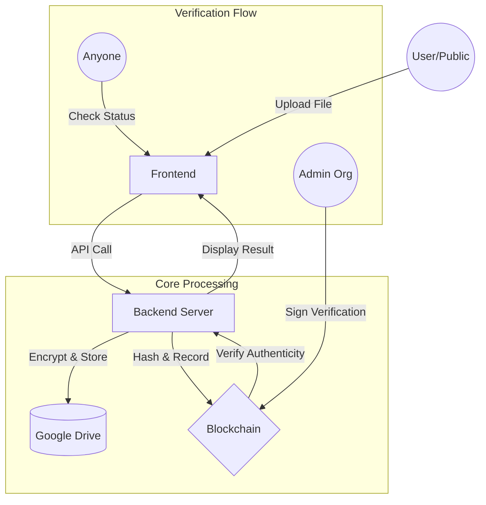

# System Architecture & Use Cases

This document describes the high-level architecture and data flow of the Document Verification System.

## Architecture Overview

The system consists of three main layers:
1.  **Frontend (React)**: User interface for registration, upload, and public verification.
2.  **Backend (Node.js/Express)**: Orchestration layer handling file encryption, Google Drive interaction, and blockchain coordination.
3.  **Blockchain (Geth/Solidity)**: Immutable registry of user identifiers, document hashes, and organization verification status.

## Data Flow Diagram (DFD)

The following diagram shows how data moves when a document is uploaded and verified.

## Functional Use Cases

### 1. Document Upload & Registration
- **Actor**: Registered User.
- **Process**:
    1. User uploads a file through the UI.
    2. Backend calculates a **SHA-256 hash** of the content.
    3. Backend **encrypts** the file and uploads it to **Google Drive**.
    4. Backend sends the document metadata (Hash, Verification ID, Drive Link) to the `UserAuth` smart contract.
    5. A transaction is mined, making the record immutable.

### 2. Public Verification
- **Actor**: Any User (No login required).
- **Process**:
    1. User provides a **Verification ID** or uploads the **original file**.
    2. Backend checks the `UserAuth` contract:
        - If ID: Finds the stored hash.
        - If File: Re-hashes the file and compares it to stored hashes.
    3. If a match is found, the system fetches the **Verification Status** from the `OrgRegistry` contract.
    4. Frontend displays the owner, upload date, and whether an organization has verified it.

### 3. Organization Verification (Audit Trail)
- **Actor**: Authorized Organization (ACEM Admin).
- **Process**:
    1. Org logs into the Admin Dashboard.
    2. Org reviews a pending document and signs a `verifyDocument` transaction on-chain.
    3. The `OrgRegistry` contract updates the status to `VERIFIED` and stores an **Audit Trail** log.

## Security Controls
- **Encryption**: Files on Google Drive are encrypted using AES-256 before upload.
- **Immutability**: Once a document hash is recorded on the blockchain, it cannot be changed.
- **Authorized Verifiers**: Only organizations authorized in `OrgRegistry` can sign verification audits.
